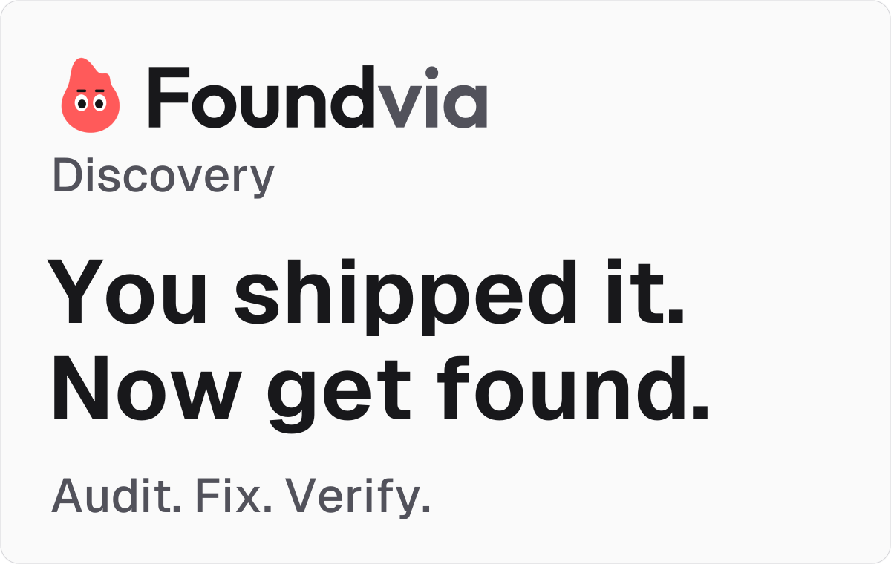
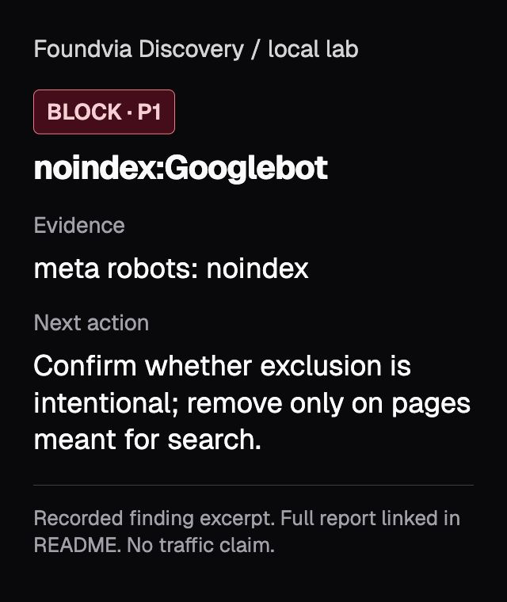
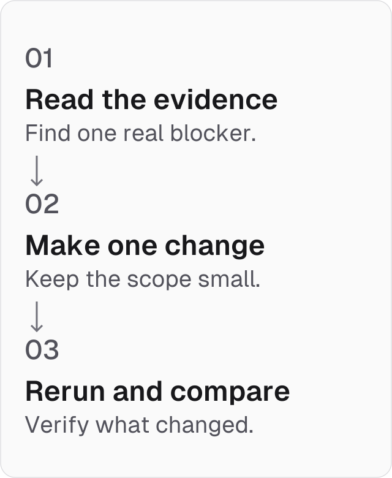

<picture>
  <source media="(prefers-color-scheme: dark)" srcset="assets/discovery-cover-dark.svg">
  
</picture>

# Foundvia Discovery

**Find what blocks your public SaaS pages on Google and ChatGPT. Fix one verified problem. Measure the next step.**

An open-source toolkit from [Foundvia](https://foundvia.dev), built by [Ronaldo Paulino](https://x.com/ronaldships). A small Python auditor, a coding-agent skill, and a practical guide for your first 100 visits.

[Start auditing](#run-your-first-audit) · [First 100 visits](playbook/first-100-visits.md) · [Español](README.es.md)

**Python 3.10+ · No runtime dependencies · [MIT code and docs](LICENSE)**

## Run your first audit

Clone or download this repository using GitHub's **Code** button. Open the downloaded folder in your terminal. You need Python installed; check with `python3 --version`.

Audit **one intended public page**. Replace the URL with yours:

```bash
python3 discovery.py audit https://example.com > audit.md
```

Open `audit.md` in your editor. Each finding includes **evidence, a next action and a verification step**. No account or API key is needed.

The auditor reads the initial page response, robots rules and one sitemap. It does not render JavaScript, impersonate a crawler, or prove indexing, rankings or traffic. [Options and limits →](docs/auditor.md)

For a report you can open in your browser, export a standalone HTML file:

```bash
python3 discovery.py audit https://example.com --format html > audit.html
```

Open `audit.html`, filter findings by status, and expand each finding for evidence and next actions. It works offline with its font included. The report interface is in English.

## Read your result

| Label | Meaning | Your next step |
|---|---|---|
| **BLOCK** | An observed response or directive needs review | Confirm whether it is intentional before changing it |
| **WARN** | Something differs from the expected configuration | Inspect the evidence; a warning is not proof of ranking harm |
| **UNKNOWN** | The tool could not complete the check | Read the access error and retry or use another evidence source |
| **INFO** | Context or a scope limitation | Review it without treating it as a pass |
| **PASS** | No issue observed in this specific check | Keep the scope in mind; this does not prove indexing or traffic |

Each report begins with a coverage summary. If initial HTML is unavailable, it lists the metadata checks that were skipped. For automation, add `--fail-on-block --require-complete` to reject both observed blocks and incomplete reports. [Troubleshooting →](docs/troubleshooting.md)

### Your sitemap is an index?

Check up to three child files to see whether the audited URL is listed:

```bash
python3 discovery.py audit https://example.com --sitemap-children 3
```

The report names matching files and discloses partial coverage or failed children. Being listed does not prove indexing. [How child inspection works →](docs/auditor.md#check-a-sitemap-indexs-children)

## See a blocker become a verified change

Try the controlled local example:

```bash
python3 discovery.py practice
```

Open `outputs-local/discovery-lab/before.md`, then `after.md`. The command starts a temporary server on your own computer and stops it afterward.

**Actual local finding:** the public guide contains a generic HTML `noindex` tag. The screenshot below shows an excerpt of the recorded Googlebot finding, presented in a readable report view. [Full generated report →](examples/discovery-lab/sample-results/before.md)



1. **Before:** Googlebot and OAI-SearchBot noindex blocks.
2. **Change:** remove only the accidental noindex element.
3. **After:** no observed blocks in the corrected page or clean re-audit.

GPTBot remains blocked in all three stages: training preferences are independent of search access. This example verifies a technical change; it demonstrates no organic growth. [Run and inspect the lab →](examples/discovery-lab/README.md)

<picture>
  <source media="(prefers-color-scheme: dark)" srcset="assets/discovery-path-dark.svg">
  
</picture>

## Use the skill with your coding agent

Install **just the flagship skill** with the [Skills CLI](https://github.com/vercel-labs/skills):

```bash
npx skills add ronaldships/foundvia-discovery --skill foundvia-discovery
```

Then ask:

> Use foundvia-discovery to audit https://YOUR-PUBLIC-SITE.com. Show the evidence and propose one small fix in my repo. Keep training preferences and private areas intact. Verify the change; keep deployment separate.

The skill can help inspect, fix, plan a useful page and measure results when you provide the necessary tools, evidence and authorization. The Python auditor also works on its own.

Local copy-install and supplied-artifact evaluation were tested with Codex CLI. Other agents have installation instructions, not a blanket compatibility certification. In the 48-response evaluation, both the skill and model-only baseline passed the case rubric; no pass-rate improvement was demonstrated. [Installation →](docs/install.md) · [Evaluation evidence →](docs/quality-results.md)

## Work toward your first 100 visits

Start with one useful page and a real question from your audience.

1. Check access and fix one accidental blocker.
2. Answer the question with a tested example.
3. Share the answer where it is relevant and permitted.
4. Review measured sessions and product outcomes each week.

The milestone is **100 measured sessions from Google organic and observed ChatGPT referrals**, counted separately and then combined. Sessions are not unique people, signups or sales. There is no promised deadline or provider endorsement.

[Follow the beginner guide →](playbook/first-100-visits.md) · [Copy the weekly tracker →](templates/weekly-tracker.csv)

## Know what the evidence covers

- **Python auditor:** initial HTTP/HTML findings, common robots rules and one same-origin sitemap. JavaScript output, real crawler/CDN access and whole-site coverage need separate checks.
- **Agent-assisted work:** scoped proposals or code changes using your tools and evidence. Deployment and live verification remain separate.
- **Search Console:** Google's reported inspection and performance data. A live test does not guarantee indexing or search appearance.
- **Analytics:** sessions and outcomes under your documented attribution rules. Missing referrers, copied UTMs and tracking gaps limit attribution.

**Quality checks:** controlled HTTP/parser/CLI tests, repository integrity checks, and a three-stage before/after lab. CI exercises Python 3.10 and 3.14 plus Node helper tests. [Latest audit and validation](docs/audit-validation.md). [O3 validation](docs/quality-results.md) · [O4 validation](docs/first-visits-validation.md)

## Find the next document

- [First 100 visits](playbook/first-100-visits.md): the main beginner path, with official sources beside each step.
- [Auditor reference](docs/auditor.md): commands, report fields and inspection limits.
- [Launch worksheet](templates/launch-worksheet.md): one question, one page and one next action.
- [Measurement dictionary](templates/measurement.md): how to count without mixing sessions, clicks and sales.
- [Advanced skill modules](skills/README.md): optional reference after the first audit.

## Build this with us

Found a wrong finding? Include a minimal public fixture, the command you ran, and expected versus actual behavior. Please remove credentials and customer data before sharing.

Run the Python checks locally:

```bash
python3 -m unittest \
discover -s tests -v
```

[Contributing](CONTRIBUTING.md) explains the workflow. If the toolkit helped you find a real issue, a star helps other builders discover it. Contributions with reproducible evidence make it more useful.

---

Code and documentation: [MIT](LICENSE). Identifying Foundvia assets: [brand provenance](docs/brand.md). Geist font: [SIL OFL 1.1](assets/fonts/OFL.txt). [Editable graphics and exports](assets/README.md).
