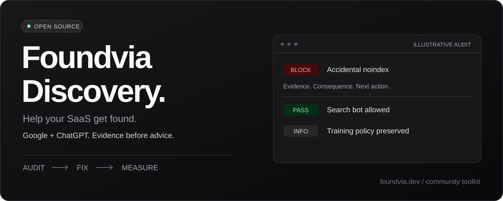
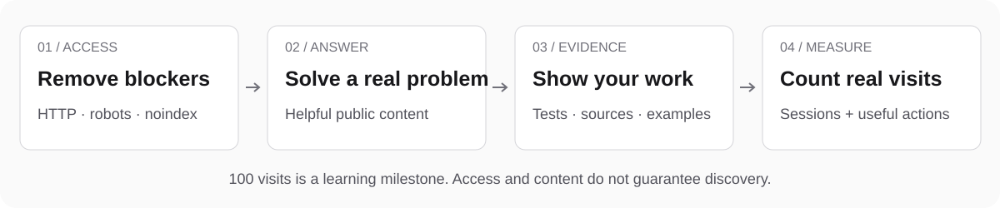

<div align="center">



**An open-source discovery toolkit from [Foundvia](https://foundvia.dev).**

Find what blocks your SaaS on Google and ChatGPT. Fix it. Measure what happens.

[](LICENSE)
[](skills/foundvia-discovery/scripts/discovery_audit.py)
[](docs/auditor.md)

[Start here](#start-with-your-site) · [Install the skill](#use-it-with-your-ai-agent) · [First 100 visits](playbook/first-100-visits.md) · [How it compares](docs/skill-review.md) · [Español](README.es.md)

</div>

## Start with your site

You shipped a useful product. Now you need to know whether people—and search crawlers—can find it.

```bash
git clone https://github.com/ronaldships/foundvia-discovery.git
cd foundvia-discovery
python3 skills/foundvia-discovery/scripts/discovery_audit.py https://your-site.com
```

No API keys. No paid crawler. No account. Python 3.10 or newer.

The auditor returns **evidence and a next action**, not a made-up ranking score. It checks one page, robots rules, and one sitemap. It does not run JavaScript or prove that your site is indexed.

Illustrative output:

```text
BLOCK · noindex:Googlebot
meta robots: noindex
Next: Confirm whether exclusion is intentional; remove only on public search pages.

PASS · robots:OAI-SearchBot
Allowed — Allow: /

INFO · robots:GPTBot
Disallowed — Disallow: /
Next: Training policy is independent of search; preserve the publisher's choice.
```

[Auditor options and limits →](docs/auditor.md)

## Use it with your AI agent

Install just the flagship skill with the [Skills CLI](https://github.com/vercel-labs/skills):

```bash
npx skills add ronaldships/foundvia-discovery --skill foundvia-discovery
```

Or copy the self-contained `skills/foundvia-discovery` folder into your agent's skill directory. See [installation](docs/install.md).

Then ask:

> Use foundvia-discovery to audit https://my-saas.com. Show the evidence, fix the blockers in my repo, and propose one useful page to help me reach my first 100 visits. Keep deployment separate.

The skill supports four modes:

| Mode | What you get |
|---|---|
| Audit | Observed blockers, evidence, confidence, and verification steps |
| Fix | Scoped code changes and checks when you provide code access and authorization |
| Launch | A customer question, content brief, original evidence, and relevant distribution venue |
| Measure | Visits and conversion signals with consistent dates and attribution limits |

It works without a particular agent or hosting platform. The auditor requires Python; browser checks and analytics access depend on your environment.

## Your first 100 visits

A practical milestone: **100 measured sessions from Google organic and ChatGPT**, counted separately and then combined. It is a target, not a guarantee or deadline.



1. **Remove blockers.** Inspect HTTP responses, noindex, robots, canonicals, and the sitemap.
2. **Answer a real question.** Use a tested tutorial, an honest comparison, or a product page with original evidence.
3. **Make it reachable.** Add relevant internal links and submit the correct sitemap in Search Console.
4. **Measure arrivals and useful actions.** Keep Search Console clicks, analytics sessions, signups, and payments separate.

[Read the English guide →](playbook/first-100-visits.md) · [Copy the report template →](skills/foundvia-discovery/references/report-template.md) · [Blank tracking sheets →](templates/)

## Why this exists

Foundvia Discovery grew out of the SEO + GEO Playbook. We are turning the playbook into something you can **run, inspect, and improve together**.

The flagship includes an executable auditor, controlled-response tests, primary-source references, and behavioral evaluation scenarios. [The review](docs/skill-review.md) explains what we learned from public skills by Corey Haines, Vercel, and Anthropic—and which claims still need testing.

We do not promise citations, traffic, or timelines. Search access does not imply training consent. `llms.txt` is optional documentation, not a Google ranking requirement. Publication dates must reflect actual events.

## Advanced modules

The original modules remain available for focused work. Several are still Spanish and contain historical examples; their quality-review status is explicit below. Start with the flagship, and verify provider-specific advice before applying older snippets.

| Module | Purpose | Review status |
|---|---|---|
| [foundvia-discovery](skills/foundvia-discovery/) | Public discovery audit → fixes → launch experiment → measurement | New; helper tested, model evaluations pending |
| [seo-ai-geo](skills/seo-ai-geo/) | Search eligibility and independent crawler policies | Core guidance corrected; historical references marked |
| [seo-slug-dates](skills/seo-slug-dates/) | Truthful content dates and migration away from generated history | Replaced fabricated-date guidance |
| [seo-technical](skills/seo-technical/) | Technical SEO and performance | Legacy; full review pending |
| [seo-on-page](skills/seo-on-page/) | Metadata, headings, links | Legacy; full review pending |
| [seo-content-strategy](skills/seo-content-strategy/) | Customer problems and content | Legacy; full review pending |
| [seo-local](skills/seo-local/) | Location-based businesses | Legacy; full review pending |
| [seo-analytics](skills/seo-analytics/) | Search Console and traffic measurement | Legacy; full review pending |
| [seo-growth-engine](skills/seo-growth-engine/) | Content and distribution at scale | Legacy; full review pending |
| [seo-nextjs-implementation](skills/seo-nextjs-implementation/) | TypeScript metadata and schema helpers | Legacy; full review pending |
| [seo-audit-website](skills/seo-audit-website/) | Optional squirrelscan integration | Third-party; not required by flagship |

Historical examples in [examples/](examples/) are snapshots, not proof of current production behavior or causal results.

## Build with us

Run the tests:

```bash
python3 -m unittest discover -s tests -v
```

Found an incorrect recommendation? Open an issue with the URL, evidence, and expected behavior. Have a real result? Share dates, what changed, and what you measured. No tokens or customer data.

[Contributing](CONTRIBUTING.md) · [Behavioral evaluation cases](evals/discovery-cases.json) · [Release notes](CHANGELOG.md) · [Distribution plan](docs/distribution.md)

If this helps you ship a useful fix, a star helps others discover the toolkit. Contributions and honest field reports help us improve it.

Built by [Ronaldo Paulino](https://x.com/ronaldships) for [Foundvia](https://foundvia.dev). [MIT licensed](LICENSE).
