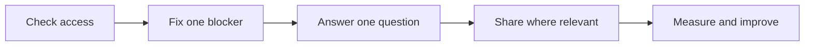

# Your first 100 visits

**One useful page. One verified fix. One measurement habit.**

For builders who shipped a SaaS and want people to find it through Google and ChatGPT. Start here; you do not need to choose between the repository's 11 skills.

The milestone is **100 measured sessions from Google organic search and observed ChatGPT referrals**, from a start date you choose. Count them separately, then add them. A session is not a unique person, signup, activation or payment. This is a learning target, not a promised result or deadline. Google and OpenAI do not endorse this project.

[Español →](first-100-visits.es.md) · [Practice locally →](../examples/discovery-lab/README.md) · [Copy the tracker →](../templates/weekly-tracker.csv)

## Before you start

You need a public page you control, access to its code or site editor, and permission to change it. For the command below, install Git and **Python 3.10+** first. Check with `git --version` and `python3 --version`; on Windows use `py -3` instead of `python3` if that is your launcher. The auditor uses Python's standard library. No API key, agent, paid crawler or npm install is required.

Set aside time for reading and decisions. The helper is small, but this guide makes no five-minute promise for fixing a live site.



## 1. Get your first report

**Action:** clone the repository and run the auditor. Replace the example URL with the full URL of one intended public page, not your dashboard. These commands run in your terminal.

```bash
git clone https://github.com/ronaldships/foundvia-discovery.git
cd foundvia-discovery
python3 skills/foundvia-discovery/scripts/discovery_audit.py https://your-site.com > audit-before.md
```

Already have the repository? Open its folder and run only the final command. Read the saved `audit-before.md` in your editor.

**Expected:** a report with a location, evidence, next action and verification for each finding. The helper reads the initial page response, robots rules and one sitemap. It does not render JavaScript or verify real crawler access, indexing or traffic. [Full limits →](../docs/auditor.md)

**Check:** open the same page signed out on your phone. Can you read its answer and use its links? An HTTP success alone is not a working product. If the command cannot fetch the page, inspect the reported error first. Do not treat `unknown` as `pass`.

Want a safe rehearsal? Run `python3 examples/discovery-lab/run.py`. Compare the generated `outputs-local/discovery-lab/before.md` and `after.md`. [How the controlled example works →](../examples/discovery-lab/README.md)

## 2. Fix one accidental blocker

**Action:** choose one observed block on a page you intend to make searchable. Read its evidence before editing.

| Finding | Small next action | Verification |
|---|---|---|
| `noindex:Googlebot` or `noindex:OAI-SearchBot` | Remove an accidental exclusion from that public page's metadata; check the response headers too | Rerun the audit after the authorized deployment; inspect rendered output if JavaScript changes metadata |
| `robots:Googlebot` or `robots:OAI-SearchBot` | Review the matching robots group and path; adjust only unintended restrictions | Rerun for the exact page; check real crawler/CDN access separately |
| Page error or `unknown` | Investigate the status, redirect, timeout or firewall evidence | Get a successful public response and rerun before drawing conclusions |
| No observed blocks | Keep intentional settings; proceed to the reader's question | Verify the browser experience and continue with step 3 |

In the [local case](../examples/discovery-lab/README.md), a useful guide accidentally contains `<meta name="robots" content="noindex">`. Removing only that element clears the two observed noindex findings. Re-auditing the corrected page requires no additional change. This proves the helper detects the controlled change; it proves no organic growth.

**Expected:** one reviewed fix, with evidence before and after. A `GPTBot` training restriction is informational, not a search failure. OAI-SearchBot supports ChatGPT search; GPTBot concerns possible training. Choose training policy separately. An allowed robots rule does not establish that your firewall permits the real crawler. [OpenAI crawler guidance](https://developers.openai.com/api/docs/bots).

**Check:** run the same command with `> audit-after.md` after the change is live and authorized. Compare the specific finding. Preserve authentication and intentional exclusions. The report's priorities are triage labels, not an SEO score.

## 3. Help Google inspect the public page

**Action:** open [Search Console](https://search.google.com/search-console) with your own account. Add the site or select an existing property you can access. A Domain property uses DNS verification and includes protocols/subdomains; a URL-prefix property covers the exact prefix and supports other verification methods. Follow the offered verification steps and retain the verification record. [Property setup](https://support.google.com/webmasters/answer/34592).

Paste your full public page URL into the inspection bar. Read the indexed result, then select **Test live URL** after a fix. Check the reported crawl, fetch and indexing permissions. View the tested page to inspect its rendered content. If the public page is ready and you have the required access, request indexing once. A live test does not establish indexing or guarantee search appearance. [URL Inspection](https://support.google.com/webmasters/answer/9012289).

If your site has a sitemap, open it to confirm that it lists your intended public URLs. In **Sitemaps**, submit its URL and review the status. Submission tells Google where the file is; it does not upload the file or guarantee indexing. A small, fully linked site may not need a sitemap. [Sitemaps report](https://support.google.com/webmasters/answer/7451001).

**Expected:** a verified property and a recorded inspection result, with any remaining issue named.

**Check:** save the inspection date, result and next action in your [launch worksheet](../templates/launch-worksheet.md). Check back for an updated indexed result. Crawling can take days to weeks; repeated requests do not speed it up. [Recrawl guidance](https://developers.google.com/search/docs/crawling-indexing/ask-google-to-recrawl).

## 4. Answer one real question

**Action:** choose a question you have actually seen in support, a customer conversation or a relevant public discussion. Record where it came from without exposing someone's identity. Use the [worksheet](../templates/launch-worksheet.md) to draft one page with:

- A title that describes the task.
- A direct answer, then steps someone can follow.
- Your own tested example, screenshot or reusable template.
- A limitation and a relevant next action.

**Worked example:** an independent musician asks how to put music links in an Instagram bio. A useful guide shows how to collect streaming/show/contact links, make a public page, test links signed out on a phone, and add its URL to the profile. Show the actual flow in your product before claiming it works. The [lab's HTML](../examples/discovery-lab/run.py) demonstrates the answer structure, not a working link-page product.

Start with one page. Add another only when it solves a distinct need. No mandatory three-page bundle, word count, fake reviews or invented usage numbers. Google's guidance emphasizes useful content and first-hand experience; this outline is our editorial recommendation, not a ranking requirement. [People-first content](https://developers.google.com/search/docs/fundamentals/creating-helpful-content).

**Expected:** a draft that completes a specific task and contains original evidence.

**Check:** follow its instructions yourself, verify links and claims, and read it on mobile. After authorized publication, link it from a relevant public page and repeat steps 1–3 for its actual URL.

## 5. Share where the answer belongs

**Action:** find one discussion or community where this exact question is relevant and links are permitted. Prepare a helpful answer that stands on its own. Include your resource only if it adds value; disclose when it is your product. Posting requires the account owner's approval when an assistant is acting for them.

Copyable draft, **not an observed result**:

> Put your streaming, next-show and contact links on one public page, then test every link on your phone before adding it to your bio. The easy detail to miss is an outdated show link. I made a checklist for this: [your guide]. I build [your product], which can help with [verified feature].

Adapt it to the actual discussion. Do not send it in bulk or promise that sharing produces Google rankings or ChatGPT citations.

**Expected:** one relevant draft or authorized contribution, logged with its destination.

**Check:** reread the venue's rules and confirm the answer helps without a click. Track social/community referrals separately: they do not count toward this guide's Google + ChatGPT milestone.

## 6. Count sessions, then learn from them

**Action:** use one analytics tool's **session-level acquisition** report, keeping its session definition and timezone unchanged. Configure the tool to exclude your own testing and known bots where supported. Test attribution before starting the count. Analytics collection remains subject to your site's consent and data practices; do not invent a second tracker for this guide.

OpenAI says its search referral URLs include `utm_source=chatgpt.com`. Check that your analytics captures it on arrival. [OpenAI publisher FAQ](https://help.openai.com/en/articles/12627856-publishers-and-developers-faq). If that signal is absent, you can use an exact parsed referrer hostname of `chatgpt.com` or `chat.openai.com` as an observed ChatGPT referral rule. That fallback is our measurement convention. Never match loose strings such as `chatgpt.com.fake.example`.

Keep one source per session according to your platform's attribution rules. A copied UTM is not independent proof that the visit came from ChatGPT. Referrers can disappear. Unknown/direct traffic stays unknown/direct; do not assign it to AI. Use your tool's Google organic channel rather than treating every Google URL as organic search.

| Signal | Where to read it | What it establishes |
|---|---|---|
| Impressions / clicks | Search Console → Performance, matching dates and Web search filter | Google search visibility / result clicks; not analytics sessions |
| Google organic / observed ChatGPT sessions | Analytics session acquisition report | Visits counted toward this milestone; not unique people |
| Signups | Successful account-creation records | Registrations, not product use |
| Activated users | A defined meaningful product action | Users who completed that action, not retention |
| New paying customers | Confirmed payment records | Paying customers; keep revenue/refunds separate |

Search Console lets you filter dates and review Queries and Pages; clicks and impressions describe search performance. Keep that diagnostic export separate from analytics totals. [Performance report](https://support.google.com/webmasters/answer/7576553).

**Expected:** a dated baseline and one row per completed, non-overlapping week in the [CSV tracker](../templates/weekly-tracker.csv). Use [the data dictionary](../templates/measurement.md) before filling it in. Blank means not measured; zero means measured and none found.

**Check:** Google sessions + ChatGPT sessions = this week's target sessions. Add each week once for the cumulative total. Never add Search Console clicks to sessions. Example arithmetic only: 12 + 3 = 15, not a reported result.

## Your weekly decision

- **An observed access block remains:** resolve that specific cause before producing more pages.
- **Accessible but not indexed:** inspect Google's reason; do not assume missing schema is the cause.
- **Indexed, little visibility:** revisit the question and your page's distinct usefulness.
- **Impressions, few clicks:** review query/title fit without a universal CTR target.
- **Sessions, little activation:** test whether the page's promise matches the product experience.
- **No ChatGPT referrals:** keep the count honest; access and a manual citation check are not traffic.

Log one change and one next review date. At 100 sessions, share what you learned with dates, channel definitions and limitations. The number opens a feedback loop; it is not proof that a technique caused growth.

---

Provider guidance checked **October 6, 2026**. This guide and the local example are maintained source files, not a PDF-only resource. The lab is controlled evidence; no live SaaS traffic experiment or recommendation guarantee is presented. [Contribute a correction](../CONTRIBUTING.md).
